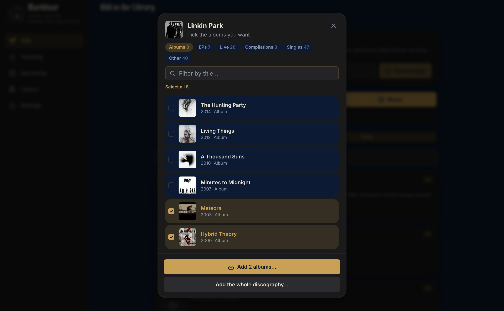
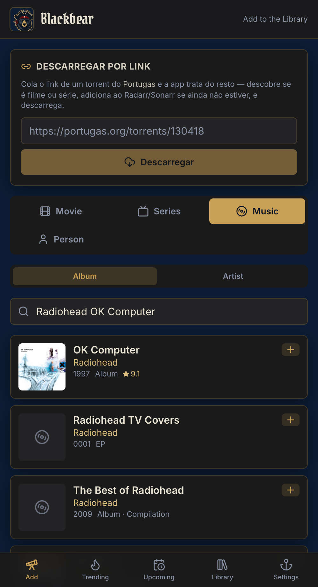

<div align="center">


# Blackbear

**Command your home media server from your phone.** 🏴‍☠️

A mobile-first, installable web app that unifies the *arr stack — Sonarr, Radarr,
Prowlarr, Bazarr and qBittorrent — behind one dark, pirate-themed interface.

[](LICENSE)
&nbsp;
&nbsp;
&nbsp;
&nbsp;

</div>

> **Brand:** a black-bear pirate captain — deep-sea-blue + midnight-black UI, treasure-gold
> accents, mutiny-red for destructive actions, Pirata One display type. Docker service names
> stay `blackbeard-*` for continuity with the running stack.

## ✨ Features

The app, in five areas:

1. **Add** — search and add movies (Radarr) and series (Sonarr) with full quality /
   monitor options. A **Person** mode searches actors & directors (TMDb) and lists their
   filmography to add from.
2. **Trending** — what's hot to grab: **Trending** (this week), **Popular**, and **For You**
   (recommendations from your Radarr/Sonarr history via TMDb). One-tap add that resolves each
   title through Radarr/Sonarr, and a "hide" button to mark titles seen so they stop showing.
3. **Upcoming** — monitored titles awaiting release: movies with their digital/physical/
   cinema dates and series episodes by air date, each with an "in X days" countdown
   (from the Radarr/Sonarr calendars).
4. **Downloads** — live state of qBittorrent torrents, Sonarr/Radarr import queues and
   Bazarr wanted-subtitle counts, auto-refreshing every 5s. Includes a one-tap "Search
   wanted subtitles" that runs Bazarr's missing-subtitle tasks.
5. **Library** — browse everything in Radarr/Sonarr (with size on disk, filterable), and
   delete a title — removing it from the *arr and, optionally, its files from disk (with a
   confirmation dialog + "delete files" checkbox).
6. **Settings & Diagnostics** — configure each service (keys persist in `config.json`, shown
   as "Saved ✓"), test connections, optional **auto-cleanup** (remove a finished torrent once
   it seeds to a chosen ratio, freeing space — skips anything still importing), and inspect
   health, versions, disk space, indexer status, providers, warnings, container logs/restart.

Mobile-first and installable: open it on your phone and **Add to Home Screen** to run
it fullscreen like a native app (PWA manifest, no input-focus zoom, no overscroll bounce).

## Screenshots

<p align="center">
  
</p>
<p align="center">
  
</p>

---

## Architecture

```
                 ┌─────────────────┐
   phone ──────► │  blackbeard-web  │  (React + Vite, served by nginx)
                 └────────┬─────────┘
                          │  /api/*  (reverse-proxied)
                 ┌────────▼─────────┐
                 │  blackbeard-api  │  (Node + Express)
                 └────────┬─────────┘
        ┌──────────┬──────┴───┬──────────┬─────────────┐
     Sonarr     Radarr     Prowlarr    Bazarr      qBittorrent
```

The **backend is the only thing that holds API keys** — the frontend never sees them.
The browser calls `/api/...`, and the backend makes the authenticated call to each
service. No database: everything is read live from the service APIs. The only persisted
state is `config.json` (URLs + keys), editable entirely from the Settings tab.

### Tech stack

- **Backend:** Node.js + Express (ESM), native `fetch`, `dockerode` for container control.
- **Frontend:** React + Vite + Tailwind CSS, `lucide-react` icons.
- **Config:** a single `config.json` file (seeded from env vars, then UI-authoritative).
- **Deploy:** two Docker containers joined to the existing `servarr_default` network.

---

## Local development

Two terminals.

**Backend** (defaults to port 3000):

```bash
cd backend
npm install
npm run dev          # node --watch src/index.js
```

On first run it creates `backend/config.json`. You can leave it empty and fill keys via
the UI, or pre-seed via env vars (see below).

**Frontend** (Vite dev server on port 5173, proxies `/api` to the backend):

```bash
cd frontend
npm install
npm run dev
```

Open <http://localhost:5173>. To point the dev proxy at a non-default backend:

```bash
BACKEND_URL=http://localhost:3000 npm run dev
```

---

## Docker deployment

The `docker-compose.yml` is meant to be brought up alongside the existing servarr stack.
It joins the **external** `servarr_default` network so it can reach the other containers
by name.

```bash
cd blackbeard
docker compose up -d --build
```

Then open `http://192.168.1.134:8085` (the web container publishes port `8085`).

What the compose file does:

- **blackbeard-api** — the backend. Mounts `./config` for the persisted `config.json`,
  and mounts the Docker socket so the "Restart container" / "Logs" diagnostics work.
- **blackbeard-web** — nginx serving the built frontend, reverse-proxying `/api` to
  `blackbeard-api:3000`.

> **Network name.** This assumes your stack's network is `servarr_default`. Confirm with
> `docker network ls`. If it differs, change the `networks` block at the bottom of
> `docker-compose.yml`.

> **Docker socket.** Mounting `/var/run/docker.sock` grants the backend container control
> over Docker. That's required for restart/logs and is acceptable on a trusted LAN. Remove
> that volume line if you don't want it — the rest of the app still works, and the buttons
> simply disable themselves.

---

## First-time configuration

Open the app → **Settings** tab. For each service set the URL and key, hit **Test
connection**, then **Save settings**. Inside Docker the default URLs use container names
(`http://sonarr:8989`, etc.); from a dev machine on the LAN use `http://192.168.1.134:<port>`.

Where to find each API key:

| Service     | Where to get the key                                                            |
|-------------|---------------------------------------------------------------------------------|
| Sonarr      | Settings → General → **API Key**                                                |
| Radarr      | Settings → General → **API Key**                                                |
| Prowlarr    | Settings → General → **API Key**                                                |
| Bazarr      | Settings → General → **API Key** (header is `X-API-KEY`)                        |
| qBittorrent | No API key — uses the Web UI **username + password** (default user `admin`)     |
| TMDb        | themoviedb.org → account **Settings → API** → API Key (v3). Needed for Trending |

Secrets are write-only from the UI: the backend returns whether a key is set, never the
value. Leaving a key field blank on save keeps the existing one.

### Env var seeds (optional)

If you'd rather pre-fill the first `config.json`, set any of these on the backend before
its first start (also listed, commented, in `docker-compose.yml`):

```
PORT, CONFIG_PATH, DOCKER_SOCKET
SONARR_URL, SONARR_API_KEY, SONARR_CONTAINER
RADARR_URL, RADARR_API_KEY, RADARR_CONTAINER
PROWLARR_URL, PROWLARR_API_KEY, PROWLARR_CONTAINER
BAZARR_URL, BAZARR_API_KEY, BAZARR_CONTAINER
QBITTORRENT_URL, QBITTORRENT_USERNAME, QBITTORRENT_PASSWORD, QBITTORRENT_CONTAINER
TMDB_URL, TMDB_API_KEY
```

Once you save in the UI, `config.json` wins and the env seeds are ignored.

---

## REST API (backend)

All endpoints are under `/api`. The frontend uses these; you can also call them directly.

### Search & Add

| Method | Path                                          | Purpose                                  |
|--------|-----------------------------------------------|------------------------------------------|
| GET    | `/api/search?type=movie\|series&term=...`     | Lookup via Radarr/Sonarr                 |
| GET    | `/api/search/person?q=...`                    | Search people (actors/directors) via TMDb|
| GET    | `/api/search/person/:id`                      | A person's movies + series (filmography) |
| GET    | `/api/add/quality-profiles?type=movie\|series`| List quality profiles                    |
| GET    | `/api/add/root-folders?type=movie\|series`    | List root folders                        |
| POST   | `/api/add`                                    | Add `{ type, item, options }`            |

`options` (movie): `qualityProfileId`, `rootFolderPath?`, `monitored`, `minimumAvailability`, `searchOnAdd`.
`options` (series): `qualityProfileId`, `rootFolderPath?`, `monitor`, `seasonFolder`, `seriesType`, `searchOnAdd`.

### Downloads

| Method | Path                                            | Purpose                              |
|--------|-------------------------------------------------|--------------------------------------|
| GET    | `/api/downloads`                                | Torrents + Sonarr/Radarr queues + Bazarr wanted |
| POST   | `/api/downloads/torrents/:hash/pause`           | Pause a torrent                      |
| POST   | `/api/downloads/torrents/:hash/resume`          | Resume a torrent                     |
| DELETE | `/api/downloads/torrents/:hash?deleteFiles=...` | Remove a torrent (optionally files)  |
| POST   | `/api/downloads/bazarr/search-wanted`           | Run Bazarr's "search missing subtitles" tasks |

### Upcoming

| Method | Path                                              | Purpose                                          |
|--------|---------------------------------------------------|--------------------------------------------------|
| GET    | `/api/pipeline?movieDays=365&episodeDays=90`      | Monitored, not-yet-available movies + episodes from the Radarr/Sonarr calendars, sorted by date |

### Trending

| Method | Path                                  | Purpose                                              |
|--------|---------------------------------------|------------------------------------------------------|
| GET    | `/api/trending?mode=trending\|popular`| Trending-this-week or popular movies + series (TMDb) |
| GET    | `/api/trending/recommended`           | "For You" — TMDb recommendations seeded from your Radarr/Sonarr library |
| POST   | `/api/trending/seen`                  | Hide an item `{ type, tmdbId }` (persisted)          |
| DELETE | `/api/trending/seen`                  | Un-hide an item `{ type, tmdbId }`                   |

### Library

| Method | Path                                       | Purpose                                       |
|--------|--------------------------------------------|-----------------------------------------------|
| GET    | `/api/library`                             | All Radarr movies + Sonarr series (with size) |
| DELETE | `/api/library/movie/:id?deleteFiles=true`  | Delete a movie from Radarr (and disk)         |
| DELETE | `/api/library/series/:id?deleteFiles=true` | Delete a series from Sonarr (and disk)        |

### Settings

| Method | Path                  | Purpose                                        |
|--------|-----------------------|------------------------------------------------|
| GET    | `/api/settings`       | Current config (secrets masked)                |
| POST   | `/api/settings`       | Save `{ services: {...} }` (blank secrets kept)|
| POST   | `/api/settings/test`  | Test a service `{ service }`                   |

### Diagnostics

| Method | Path                                  | Purpose                                          |
|--------|---------------------------------------|--------------------------------------------------|
| GET    | `/api/diagnostics`                    | Health, versions, disk, indexers, providers, warnings |
| GET    | `/api/diagnostics/logs/:service?tail=`| Docker logs (needs socket)                       |
| POST   | `/api/diagnostics/restart/:service`   | Restart container (needs socket)                 |

`:service` is one of `sonarr`, `radarr`, `prowlarr`, `bazarr`, `qbittorrent`.

---

## Development & deploy workflow

Git is the source of truth; **secrets never go in git** — they live only in
`config/config.json` on the host (git-ignored), entered through the Settings tab.

Typical loop, editing from any machine and running Docker on the home server (e.g. a
Mac mini):

```bash
# on your laptop
git clone git@github.com:<you>/blackbear.git
cd blackbear
# ...edit, then:
git commit -am "feat: ..." && git push

# deploy to the server (SSHes in, pulls, rebuilds)
./scripts/deploy.sh
# or override the target:
BLACKBEAR_HOST=user@host BLACKBEAR_DIR=/srv/blackbear ./scripts/deploy.sh
```

For local development without the server, run the dev servers (`backend/` `npm run dev`
and `frontend/` `npm run dev`) and point them at the live services over the LAN.

**Recommended upgrades:**

- **Tailscale** — SSH to the server and reach the web UI by a stable name from anywhere,
  no port-forwarding. Replace the LAN IP in `deploy.sh` with the Tailscale host.
- **CI images (GHCR)** — a GitHub Action can build and push the two images to
  `ghcr.io` on every push to `main`; the server then just `docker compose pull && up -d`
  instead of building locally. Faster deploys and the server needs no source checkout.

## Remote access (Cloudflare Tunnel + Access)

> ⚠️ **Blackbear has no built-in auth and can restart containers (Docker socket).**
> Never expose it to the internet unprotected. The setup below puts it behind
> **Cloudflare Access**, which authenticates *you* before any traffic reaches the app.

A `cloudflared` service ships in `docker-compose.yml` under the `cloudflare` profile, so
it only runs when you ask for it. You need a domain managed in Cloudflare.

1. **Create the tunnel.** Cloudflare **Zero Trust** dashboard → **Networks → Tunnels →
   Create a tunnel** → *Cloudflared* → name it `blackbear`. On the **Docker** tab, copy the
   token and put it in a local `.env` (git-ignored — see `.env.example`):

   ```
   CLOUDFLARE_TUNNEL_TOKEN=eyJ...your-token...
   ```

2. **Map a public hostname.** Still in the tunnel config, add a **Public Hostname**:
   - Subdomain `blackbear`, your domain, path empty
   - Service: **HTTP** → `blackbeard-web:80`

3. **Start the tunnel** (alongside the stack):

   ```bash
   docker compose --profile cloudflare up -d
   ```

   > Tip: add `COMPOSE_PROFILES=cloudflare` to your `.env` so plain `docker compose up -d`
   > (and `scripts/deploy.sh`) always bring the tunnel up — no need to pass the flag each time.

4. **Gate it with Access.** Zero Trust → **Access → Applications → Add an application →
   Self-hosted** → domain `blackbear.yourdomain.com`. Add a policy: **Allow**, with a rule
   `Emails → your@email`. Pick **One-time PIN** (or Google) as the login method.

Now `https://blackbear.yourdomain.com` prompts you to log in (email code), then serves the
app — UI and `/api` both, through the single hostname. The LAN port `8085` keeps working at
home; the tunnel is purely for outside access.

> Tip: add your phone-friendly login method and you can still **Add to Home Screen** the
> tunnel URL for a native-feeling app away from home.

## Notes

- **No auth.** Intended for the LAN, to live behind Tailscale later. Auth is a v2 item.
- **Resilient by design.** If a service is offline or misconfigured, its panel shows an
  error but the rest of the app keeps working — one dead Prowlarr won't sink the ship.
- **qBittorrent 5.0** renamed `pause`/`resume` to `stop`/`start`; Blackbear tries the new
  endpoints and falls back to the old ones automatically.

*Yo ho ho and a bottle of rum.* 🏴‍☠️
